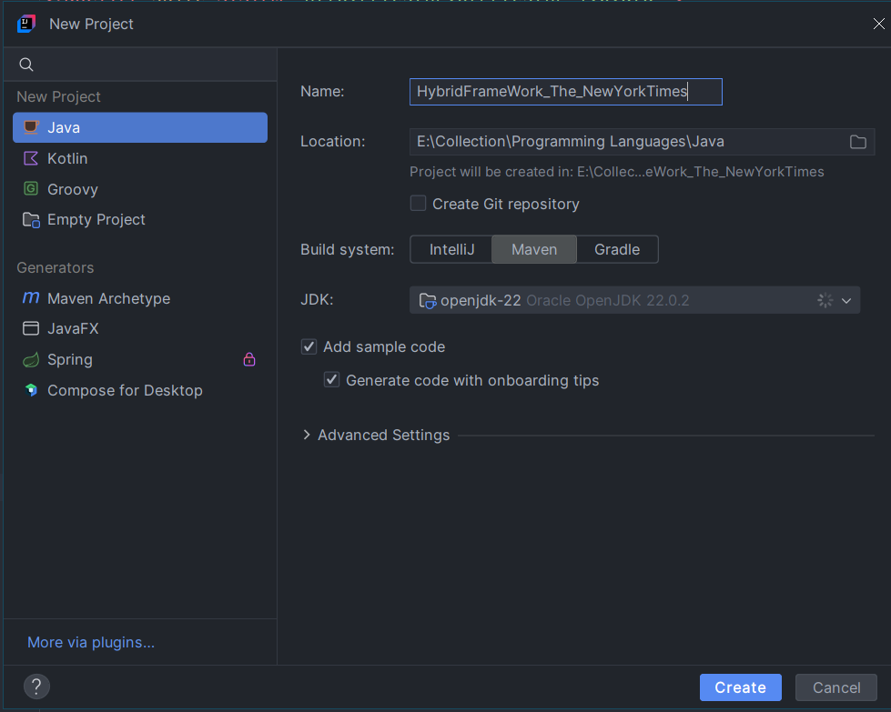
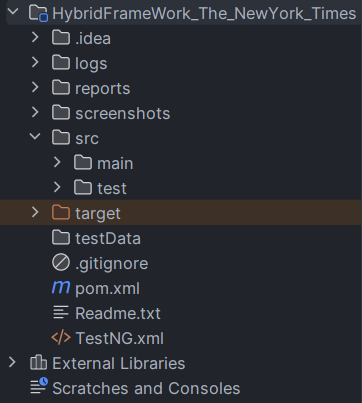
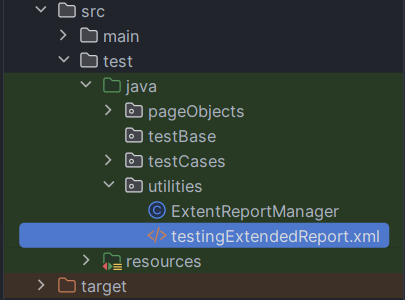

<h1 align="center">Web Automation in The New York Times</h1>

Automation testing on The New York Times website. There are 16 various types of test cases. Achieving more than 75% of test cases on homepage and search page. Show casing the test result using TestNG on behalf of Hybrid Automation Framework.

## Usages
- CI (Continuous Integration)
- CD (Continuous Delivery)
- Automate Website
- Testing Various Cases

## Implementation

  
   
  <em>Figure 1: Create Maven Project or Clone The Repo</em>

  
   
  <em>Figure 2: Folder Struture</em>

## Dependenies
<a href="https://mvnrepository.com/artifact/org.seleniumhq.selenium/selenium-java" target="blank">Selenium</a>
<a href="https://mvnrepository.com/artifact/org.apache.poi/poi" target="blank">Excel File poi</a>
<a href="https://mvnrepository.com/artifact/org.apache.poi/poi-ooxml" target="blank">Excel File poi-ooxml</a>
<a href="https://mvnrepository.com/artifact/org.apache.logging.log4j/log4j-api" target="blank">Logs api</a>
<a href="https://mvnrepository.com/artifact/org.apache.logging.log4j/log4j-core" target="blank">Logs core</a>
<a href="https://mvnrepository.com/artifact/org.apache.logging.log4j/log4j-slf4j-impl" target="blank">Logs slf4j-impl</a>
<a href="https://mvnrepository.com/artifact/org.testng/testng" target="blank">TestNG</a>
<a href="https://mvnrepository.com/artifact/com.aventstack/extentreports" target="blank">TestNG Extent Reports</a>
<a href="https://mvnrepository.com/artifact/commons-io/commons-io" target="blank">TestNG commons-io</a>
<a href="https://mvnrepository.com/artifact/org.apache.commons/commons-lang3" target="blank">TestNG commons-lang3</a>

## Run Project

  
   
  <em>Figure 4: Run The testingExtentReport.xml File</em>

 
